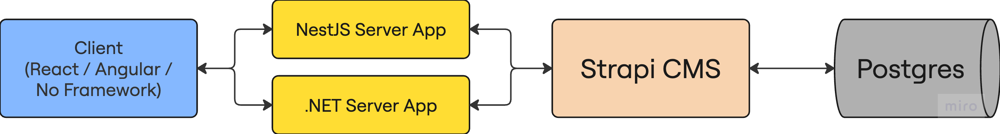

# SP2025 CMS Fullstack Boilerplate

This project is a fullstack web application boilerplate featuring:

- **Strapi CMS** (for content and user management)
- **NestJS Server** (for API, authentication, and business logic)
- **Plain JavaScript Client** (for the frontend)

It is designed for students to learn how to integrate a modern CMS, a robust backend, and a simple frontend, and to extend the system with new features.

## 🎯 Learning Objectives

By working with this project, you will learn:

- **Modern Architecture Patterns**: Understanding microservices, API gateways, and layered architecture
- **CMS Integration**: How to use Strapi as a headless CMS with custom content types
- **Backend Development**: Building REST APIs with NestJS, including authentication and data transformation
- **Frontend Development**: Creating responsive UIs with vanilla JavaScript
- **Database Design**: Working with PostgreSQL and understanding content type schemas
- **API Design**: Creating clean, documented APIs with proper error handling
- **Authentication**: Implementing JWT-based authentication across multiple services
- **Data Flow**: Understanding how data moves between client, server, CMS, and database

---

## 📁 Project Structure

```
sp2025-cms/
├── client/                    # Plain JS frontend
│   ├── index.html            # Main HTML file
│   ├── script.js             # JavaScript logic
│   └── style.css             # Styling
├── cms/                      # Strapi CMS (Node.js)
│   ├── src/
│   │   ├── api/              # Content types and API endpoints
│   │   │   ├── article/      # Article content type
│   │   │   └── user/         # User content type
│   │   └── extensions/       # Custom extensions
│   ├── config/               # Strapi configuration
│   └── public/               # Static files and uploads
├── server/                   # NestJS backend (Node.js)
│   ├── src/
│   │   ├── articles/         # Articles module
│   │   ├── auth/             # Authentication module
│   │   ├── shared/           # Shared DTOs and utilities
│   │   └── services/         # External service integrations
└── README.md                 # This file
```

### 🔄 How the Parts Communicate

- **Client** communicates with the **NestJS server** via HTTP (REST API).
- **NestJS server** communicates with **Strapi CMS** via HTTP (REST API), acting as a secure proxy and business logic layer.
- **Strapi CMS** manages content (articles) and users, and exposes its own REST API.

### 🏗️ System Architecture



_The diagram shows the complete data flow: Client applications (React/Angular/No Framework) communicate with server applications (NestJS/.NET), which in turn interact with Strapi CMS, which stores data in PostgreSQL database._

---

## 🏗️ Complete Data Flow Architecture

Understanding how data flows through this system is crucial for development and debugging. Here's the complete journey of a request:

### 1. **Client → NestJS Server** (Frontend to Backend)

**Example: User visits the homepage to see articles**

```javascript
// Client (client/script.js)
const response = await fetch("http://localhost:3000/api/articles", {
  method: "GET",
  headers: { "Content-Type": "application/json" },
});
```

**What happens:**

- Client sends HTTP request to NestJS server
- NestJS receives request at `/api/articles` endpoint
- Server processes the request and calls Strapi CMS to fetch articles

### 2. **NestJS Server → Strapi CMS** (Backend to CMS)

**Example: Fetching articles from Strapi**

```typescript
// NestJS Server (server/src/articles/articles.service.ts)
const response = await this.strapiService.get<
  StrapiResponseDto<StrapiArticleDto[]>
>("/articles", {
  "pagination[page]": page,
  "pagination[pageSize]": pageSize,
  populate: "*",
});
```

**What happens:**

- NestJS uses `StrapiService` to communicate with Strapi
- Server sends HTTP request to `http://localhost:1337/api/articles`
- Strapi processes the request and queries the database
- Strapi returns article data in its standard format

### 3. **Strapi CMS → PostgreSQL Database** (CMS to Database)

**Example: Strapi fetching articles from database**

```typescript
// Strapi automatically handles database queries
// When you call GET /api/articles, Strapi:
// 1. Reads the schema from cms/src/api/article/content-types/article/schema.json
// 2. Generates SQL query: SELECT * FROM articles WHERE published_at IS NOT NULL
// 3. Executes query against PostgreSQL
// 4. Returns formatted JSON response
```

**What happens:**

- Strapi reads content type schemas (like `article/schema.json`)
- Generates appropriate SQL queries based on the schema
- Executes queries against PostgreSQL database
- Formats response with Strapi's standard structure

### 4. **Response Flow Back** (Database → CMS → Server → Client)

**Example: Article data journey**

```json
// 1. PostgreSQL returns raw data
{
  "id": 1,
  "title": "Getting Started with Strapi",
  "content": "[{\"type\":\"paragraph\",\"children\":[{\"text\":\"Welcome to our blog!\"}]}]",
  "published_at": "2025-07-12T10:00:00Z"
}

// 2. Strapi formats it (cms/src/api/article/controllers/article.ts)
{
  "data": [{
    "id": 1,
    "attributes": {
      "title": "Getting Started with Strapi",
      "content": [...],
      "publishedAt": "2025-07-12T10:00:00Z"
    }
  }],
  "meta": { "pagination": {...} }
}

// 3. NestJS transforms it (server/src/articles/articles.service.ts)
{
  "data": [{
    "id": 1,
    "title": "Getting Started with Strapi",
    "content": [...],
    "publishedAt": "2025-07-12T10:00:00Z"
  }],
  "meta": { "pagination": {...} }
}

// 4. Client receives it (client/script.js)
// Client displays the articles in the UI
```

### 5. **Key Communication Points**

#### **Article Fetching Flow:**

```
Client → GET /api/articles → NestJS → GET /articles → Strapi → Articles Table → JSON Response
```

#### **Article Creation Flow:**

```
Client → POST /api/articles → NestJS → POST /articles → Strapi → Articles Table → Success Response
```

#### **Article Update Flow:**

```
Client → PUT /api/articles/:id → NestJS → PUT /articles/:id → Strapi → Articles Table → Updated Response
```

### 6. **Error Handling at Each Layer**

**Client Layer:**

```javascript
try {
  const response = await fetch("/api/articles");
  if (!response.ok) throw new Error("HTTP error");
  const data = await response.json();
  // Display articles in UI
} catch (error) {
  console.error("Client error:", error);
  // Show user-friendly error message
}
```

**NestJS Layer:**

```typescript
try {
  const articles = await this.strapiService.get("/articles");
  return this.transformStrapiResponse(articles);
} catch (error) {
  this.logger.error("Server error:", error);
  throw new NotFoundException("Articles not found");
}
```

**Strapi Layer:**

```typescript
// Strapi automatically handles database errors
// and returns standardized error responses
{
  "error": {
    "status": 404,
    "name": "NotFoundError",
    "message": "Article not found"
  }
}
```

### 7. **Data Transformation Layers**

**Strapi → NestJS Transformation:**

```typescript
// server/src/articles/articles.service.ts
private transformStrapiArticle(strapiArticle: StrapiArticleDto): ArticleDto {
  return {
    id: strapiArticle.id,
    title: strapiArticle.title,
    content: strapiArticle.content,
    publishedAt: new Date(strapiArticle.publishedAt),
  };
}
```

**NestJS → Client Transformation:**

```javascript
// client/script.js
result.data.forEach((article) => {
  // Transform rich text content for display
  let textContent = "";
  if (article.content && Array.isArray(article.content)) {
    article.content.forEach((paragraph) => {
      paragraph.children.forEach((child) => {
        if (child.text) textContent += child.text + " ";
      });
    });
  }
  // Display in UI
});
```

### 8. **Why This Architecture?**

**Benefits:**

- **Separation of Concerns**: Each layer has a specific responsibility
- **Security**: NestJS acts as a secure proxy, hiding Strapi's internal structure
- **Flexibility**: Can easily switch databases or add new features
- **Scalability**: Each component can be scaled independently
- **Maintainability**: Clear data flow makes debugging easier

**Real-world Example:**
When a user creates an article:

1. **Client**: User fills form and clicks "Create Article"
2. **NestJS**: Validates data, transforms format, calls Strapi
3. **Strapi**: Validates against schema, saves to PostgreSQL
4. **Database**: Stores the article data
5. **Response**: Data flows back through all layers to confirm creation

This architecture ensures that each component can be developed, tested, and deployed independently while maintaining a clear data flow throughout the system.

---

## 🛠️ Technology Stack Deep Dive

### **Strapi CMS**

- **Purpose**: Headless CMS for content management
- **Key Features**:
  - Content type builder (no-code schema definition)
  - Built-in authentication and authorization
  - REST and GraphQL APIs
  - Media management
  - Role-based permissions
- **Database**: PostgreSQL (recommended for production)
- **Admin Panel**: Web-based interface at `/admin`

### **NestJS Server**

- **Purpose**: Backend API with business logic and security
- **Key Features**:
  - TypeScript-first framework
  - Dependency injection
  - Decorators for routing and validation
  - Built-in Swagger documentation
  - JWT authentication
  - Exception filters and interceptors
- **Architecture**: Modular design with controllers, services, and DTOs

### **Plain JavaScript Client**

- **Purpose**: Simple frontend demonstration
- **Key Features**:
  - No build step required
  - Vanilla JavaScript for learning
  - Responsive design with CSS
  - Fetch API for HTTP requests
- **Benefits**: Easy to understand and modify

---

## 📋 Prerequisites

- [Node.js](https://nodejs.org/) (v18+ recommended)
- [pnpm](https://pnpm.io/) (install globally: `npm install -g pnpm`)
- [PostgreSQL](https://www.postgresql.org/) (v12+ recommended)

### **Why These Versions?**

- **Node.js 18+**: Required for modern ES modules and better performance
- **pnpm**: Faster, more efficient package manager with better dependency resolution
- **PostgreSQL**: Strapi's recommended database for production use

---

## 🚀 Quick Start Guide

### 1. Clone the Repository

```bash
git clone <your-repo-url> sp2025-cms
cd sp2025-cms
```

### 2. Install Dependencies (in order!)

#### 2.1. Strapi CMS

```bash
cd cms
pnpm install
```

#### 2.2. NestJS Server

```bash
cd ../server
pnpm install
```

#### 2.3. Client (optional, for static assets)

```bash
cd ../client
# No dependencies for plain JS, but you can add your own if needed
```

---

## ⚙️ Environment Variables

### 3.1. Strapi CMS

- Copy `.env.example` to `.env` in the `cms/` directory and adjust as needed.

### 3.2. NestJS Server

- Copy `.env.example` to `.env` in the `server/` directory and set:
  - `STRAPI_URL` (should point to your Strapi instance, e.g., `http://localhost:1337`)
  - `STRAPI_API_TOKEN` (create in Strapi admin panel under Settings → API Tokens)
  - `JWT_SECRET` (any strong secret for JWT signing)

---

## 🗄️ Database Setup

### **PostgreSQL Installation**

**macOS (using Homebrew):**

```bash
brew install postgresql
brew services start postgresql
```

**Ubuntu/Debian:**

```bash
sudo apt update
sudo apt install postgresql postgresql-contrib
sudo systemctl start postgresql
sudo systemctl enable postgresql
```

**Windows:**
Download and install from [PostgreSQL official website](https://www.postgresql.org/download/windows/)

### **Database Configuration**

1. **Create Database and User:**

```sql
-- Connect to PostgreSQL as superuser
sudo -u postgres psql

-- Create database and user
CREATE DATABASE strapi;
CREATE USER strapi WITH PASSWORD 'strapi';
GRANT ALL PRIVILEGES ON DATABASE strapi TO strapi;
\q
```

2. **Environment Variables:**
   Set the following environment variables in `cms/.env`:

- `DATABASE_CLIENT=postgres`
- `DATABASE_HOST=localhost` (or your DB host)
- `DATABASE_PORT=5432` (default Postgres port)
- `DATABASE_NAME=strapi` (your database name, use the project name)
- `DATABASE_USERNAME=strapi` (your database user)
- `DATABASE_PASSWORD=strapi` (your database password)
- `DATABASE_SSL=false` (locally should be false, set to true if using SSL on prod)

Example `cms/.env` section:

```env
DATABASE_CLIENT=postgres
DATABASE_HOST=localhost
DATABASE_PORT=5432
DATABASE_NAME=strapi
DATABASE_USERNAME=strapi
DATABASE_PASSWORD=strapi
DATABASE_SSL=false
```

3. **Custom Settings:**
   Edit `cms/config/database.ts` if you need custom settings.
   Start Strapi after the database is ready.

---

## 🏃‍♂️ Start the Applications (in order!)

### 5.1. Start Strapi CMS

```bash
cd cms
pnpm develop
```

- Visit [http://localhost:1337/admin](http://localhost:1337/admin) to set up the Strapi admin user (first time only).
- Make sure the built-in **Users & Permissions** plugin is enabled (it is by default).

### 5.2. Start NestJS Server

```bash
cd ../server
pnpm start:dev
```

- The API will be available at [http://localhost:3000/api](http://localhost:3000/api)
- Swagger docs: [http://localhost:3000/api/docs](http://localhost:3000/api/docs)

### 5.3. Start the Client

```bash
cd ../client
# Open index.html in your browser (no build step needed)
```

---

## 📖 Using the Application

### **Authentication Flow**

1. **Register a new user** via the client or by POSTing to `/api/auth/register`
2. **Login** via the client or by POSTing to `/api/auth/login`
3. **JWT Token** is returned and stored for subsequent requests

### **Content Management**

- **Articles** are managed in Strapi and fetched via the NestJS server
- **Authentication** uses Strapi's built-in Users & Permissions plugin (`/auth/local` and `/auth/local/register`)

### **API Endpoints**

**Authentication:**

- `POST /api/auth/register` - Register new user
- `POST /api/auth/login` - Login user
- `GET /api/auth/profile` - Get user profile (protected)

**Articles:**

- `GET /api/articles` - Get all articles
- `GET /api/articles/:id` - Get specific article
- `POST /api/articles` - Create new article (protected)
- `PUT /api/articles/:id` - Update article (protected)
- `DELETE /api/articles/:id` - Delete article (protected)

---

## 🔧 Adding/Expanding Functionality

### **Adding New Content Types**

1. **In Strapi Admin:**

   - Go to Content-Type Builder
   - Create new content type (e.g., "Product")
   - Define fields and relationships
   - Set permissions

2. **In NestJS Server:**
   - Create new module (e.g., `products/`)
   - Add controller, service, and DTOs
   - Implement CRUD operations
   - Add authentication guards

### **Adding New API Endpoints**

```typescript
// Example: Adding a search endpoint
@Get('search')
async searchArticles(@Query('q') query: string) {
  return this.articlesService.search(query);
}
```

### **Securing Endpoints**

```typescript
// Example: Protecting an endpoint
@UseGuards(JwtAuthGuard)
@Post()
async createArticle(@Body() createArticleDto: CreateArticleDto) {
  return this.articlesService.create(createArticleDto);
}
```

### **Adding Roles/Permissions**

1. **In Strapi Admin:**

   - Go to Settings → Users & Permissions → Roles
   - Create new roles (e.g., "Editor", "Author")
   - Set permissions for each content type

2. **In NestJS:**
   - Implement role-based guards
   - Check user permissions before operations

---

## 🐛 Troubleshooting

### **Common Issues and Solutions**

#### **CORS Errors**

```bash
# In Strapi config/middlewares.ts
module.exports = {
  settings: {
    cors: {
      enabled: true,
      origin: ['http://localhost:3000', 'http://localhost:3001']
    }
  }
}
```

#### **Database Connection Issues**

- Verify PostgreSQL is running: `sudo systemctl status postgresql`
- Check database credentials in `cms/.env`
- Ensure database exists: `psql -U postgres -d postgres`

#### **Authentication Failures**

- Verify API token in Strapi admin (Settings → API Tokens)
- Check JWT secret in server `.env`
- Ensure using built-in Users & Permissions plugin

#### **Port Conflicts**

- Strapi: Change port in `cms/config/server.ts`
- NestJS: Change port in `server/src/main.ts`

### **Debug Mode**

**Strapi Debug:**

```bash
cd cms
DEBUG=strapi:* pnpm develop
```

**NestJS Debug:**

```bash
cd server
DEBUG=* pnpm start:dev
```

---

## 🚀 How to Expand This Project

### **Frontend Enhancements**

- Add React/Vue.js for more complex UIs
- Implement real-time updates with WebSockets
- Add offline support with Service Workers
- Implement progressive web app features

### **Backend Enhancements**

- Add GraphQL support with Apollo Server
- Implement caching with Redis
- Add file upload handling
- Implement rate limiting and API versioning

### **CMS Enhancements**

- Add custom plugins and extensions
- Implement webhooks for real-time updates
- Add custom field types
- Implement multi-language support

### **DevOps and Deployment**

- Add Docker containers for each service
- Implement CI/CD pipelines
- Add monitoring and logging
- Set up staging and production environments

### **Testing Strategy**

- Unit tests for services and utilities
- Integration tests for API endpoints
- End-to-end tests for complete workflows
- Performance testing for scalability

---

## 📚 Learning Resources

### **Strapi Documentation**

- [Official Strapi Docs](https://docs.strapi.io/)
- [Content Type Builder](https://docs.strapi.io/dev-docs/content-type-builder)
- [API Development](https://docs.strapi.io/dev-docs/api-development)

### **NestJS Documentation**

- [Official NestJS Docs](https://docs.nestjs.com/)
- [Controllers](https://docs.nestjs.com/controllers)
- [Providers](https://docs.nestjs.com/providers)
- [Guards](https://docs.nestjs.com/guards)

### **PostgreSQL Resources**

- [Official PostgreSQL Docs](https://www.postgresql.org/docs/)
- [PostgreSQL Tutorial](https://www.postgresqltutorial.com/)

### **JavaScript/TypeScript**

- [TypeScript Handbook](https://www.typescriptlang.org/docs/)
- [Modern JavaScript](https://javascript.info/)

---

Happy coding! 🚀
