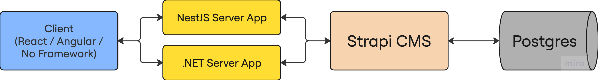

# SP2025 CMS Fullstack Boilerplate

This project is a fullstack web application boilerplate featuring:

- **Strapi CMS** (for content and user management)
- **NestJS Server** (for API, authentication, and business logic)
- **Plain JavaScript Client** (for the frontend)

It is designed for students to learn how to integrate a modern CMS, a robust backend, and a simple frontend, and to extend the system with new features.

## 🎯 Learning Objectives

By working with this project, you will learn:

- **Modern Architecture Patterns**: Understanding microservices, API gateways, and layered architecture
- **CMS Integration**: How to use Strapi as a headless CMS with custom content types
- **Backend Development**: Building REST APIs with NestJS, including authentication and data transformation
- **Frontend Development**: Creating responsive UIs with vanilla JavaScript
- **Database Design**: Working with PostgreSQL and understanding content type schemas
- **API Design**: Creating clean, documented APIs with proper error handling
- **Authentication**: Implementing JWT-based authentication across multiple services
- **Data Flow**: Understanding how data moves between client, server, CMS, and database

## 📁 Project Structure

```text
sp2025-cms/
├── client/                    # Plain JS frontend
│   ├── index.html            # Main HTML file
│   ├── script.js             # JavaScript logic
│   └── style.css             # Styling
├── cms/                      # Strapi CMS (Node.js)
│   ├── src/
│   │   ├── api/              # Content types and API endpoints
│   │   │   ├── article/      # Article content type
│   │   │   └── user/         # User content type
│   │   └── extensions/       # Custom extensions
│   ├── config/               # Strapi configuration
│   └── public/               # Static files and uploads
├── server/                   # NestJS backend (Node.js)
│   ├── src/
│   │   ├── articles/         # Articles module
│   │   ├── auth/             # Authentication module
│   │   ├── shared/           # Shared DTOs and utilities
│   │   └── services/         # External service integrations
└── README.md                 # This file
```

### 🔄 How the Parts Communicate

- **Client** communicates with the **NestJS server** via HTTP (REST API).
- **NestJS server** communicates with **Strapi CMS** via HTTP (REST API), acting as a secure proxy and business logic layer.
- **Strapi CMS** manages content (articles) and users, and exposes its own REST API.

### 🏗️ System Architecture



_The diagram shows the complete data flow: Client applications (React/Angular/No Framework) communicate with server applications (NestJS/.NET), which in turn interact with Strapi CMS, which stores data in PostgreSQL database._

## 📚 Documentation Index

### 🚀 Getting Started

- [How to Install and Setup](./how-to-install.md) - Complete installation guide
- [How to Configure Environment](./how-to-configure.md) - Environment variables and database setup
- [How to Start the Applications](./how-to-start.md) - Running all services

### 🏗️ Architecture & Data Flow

- [How the System Works](./how-system-works.md) - Complete data flow architecture
- [Technology Stack Overview](./technology-stack.md) - Deep dive into technologies used

### 📖 Usage Guides

- [How to Use the Application](./how-to-use.md) - Authentication and content management
- [API Reference](./api-reference.md) - Complete API endpoints documentation

### 🔧 Development Guides

- [How to Add New Features](./how-to-add-features.md) - Adding content types and API endpoints
- [How to Troubleshoot Issues](./how-to-troubleshoot.md) - Common problems and solutions
- [How to Expand the Project](./how-to-expand.md) - Advanced enhancements and extensions

### 📚 Learning Resources

- [Learning Resources](./learning-resources.md) - Documentation links and tutorials

---

Happy coding! 🚀
